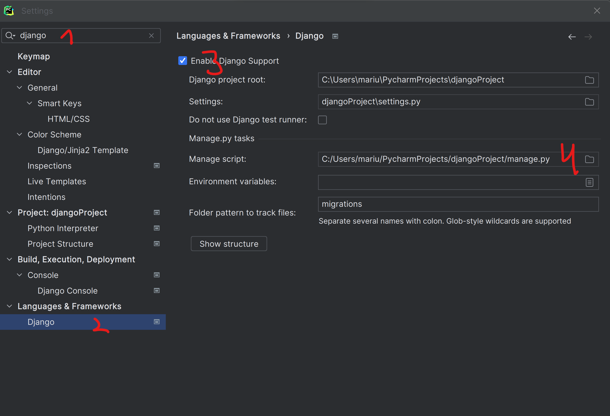

# Project and Homework

Acest proiect va fi baza pentru mai multe teme de acasa pentru voi:

* Aici vom avea [Project information](#project-info)
* Aici vom avea [homework](#homework)

In caz de nevoie de informatii, incercati sa navigati documentatia oficiala
a [Django](https://docs.djangoproject.com/en/4.2/), sau [DjangoRestFramework](https://www.django-rest-framework.org/).
De asemenea nu va rusinati sa utilizati chatgpt, stackoverflow sau alte surse.

Va sugerez sa utilizati [Pycharm Professional](https://www.jetbrains.com/pycharm/download/).

# Project info

Proiectul este un Web Service ce va imbina mai multe applicatii.

* TODO App
* Weather App

Scopul cursantilor va fi sa introduca funtcionalitati in aceasta applicatie, sau sa modifice functionalizati existente.

## Project setup

Pentru a configura proiectul, sunt necesare urmatoarele:

1. Instalam Pycharm Professional
2. Instalam requirements.txt
   > Se poate de instalat prin terminal ruland
   > pip install -r requirements.txt
3. Facem setup la django 
    1. Accesam setarile la PyCharm, si cautam Django
    2. Selectam Django din Frameworks & ...
    3. Facem Enable Django Support
    4. Specificam path-ul la manage.py
    5. Daca mai e necesar, specificam alte path-uri, ca in exemplu

## Cum testam functionalul

Adaugam in mapa [test_client](/test_client) fisiere care testeaza functionalul,
ca [exemplu](/test_client/example_client.py).

# Homework

1. Adaugati o noua functionalitate in [todo app](/todo/) ce va permite sa marcam un task cu id-ul din
   request ca completat.
    * Modificati [todo views](/todo/views.py) adaugand o noua functie ce va
      apela [mark_as_complete din tasks.py](/todo/tasks.py).
    * Modificati [urls](/todo/urls.py) adaugant un nou URL pentru functia noastra
2. Adaugati codul necesar in [weather views](/weather/views.py) ce va gasi vremea pentru orasul din
   parametrul `city_name`.
    * Testati creand un fisier nou, care testeza dupa url-ul `http://localhost:8000/weather/get/Chisinau`